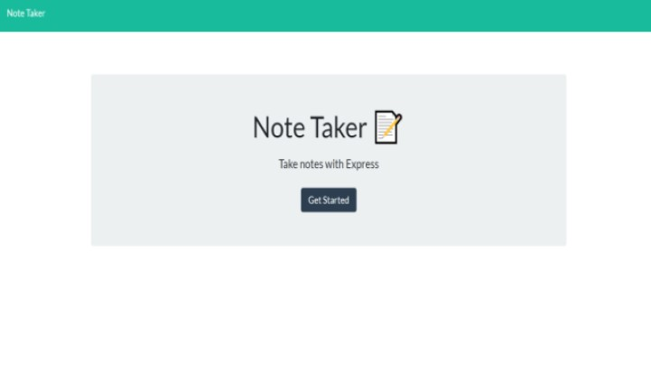
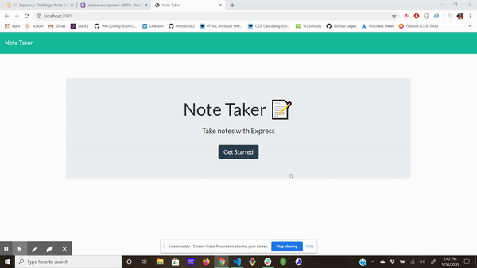
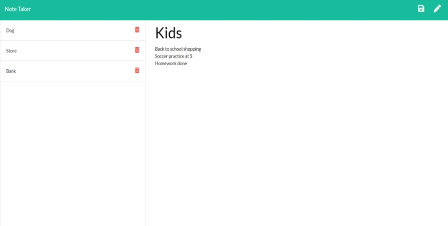

<h1 align="center">Note Taker</h1>

<p align="center">


</p>

<p align="center">

</p>


## Table of Contents
- [Description](#description)
- [Installation](#install)
- [Usage](#usage)
- [Questions](#questions)

## Description
### This is a Express.js application to help you take and keep notes.

## Install
```
npm init

npm install node

npm install express

heroku create
```
## Usage
### You will be able to keep and save notes on this application. You can title and then add items underneath. 
          


## Below is a link to the GitHub repository   
[Note Taker](https://github.com/mattkohl82/note-taker)    

## Application deployed live on Heroku
[Heroku live application](https://serene-escarpment-48950.herokuapp.com/)

### Below is a GIF demostrating the application 
 
  

### Screen shot of the taken notes

   

## Questions
### [Mattkohl82 for GitHub](https://github.com/Mattkohl82)  
### mattkohl82@gmail.com for ✉️ email 


